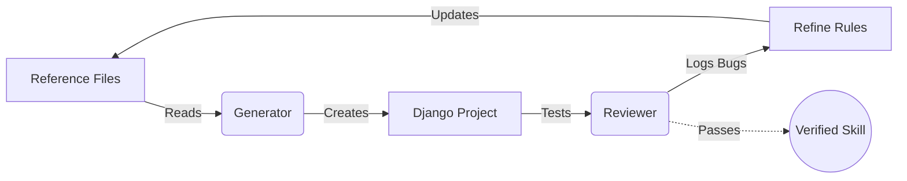

# Can an LLM generate your Django project boilerplate?

*Suggested Reddit title: "Can an LLM generate your Django project boilerplate? Several weeks of trying, and everything the model broke along the way."*

---

Here is how I think starting a Django project should work.

You type one sentence: "Job board. Postgres, Google login, background tasks, Stripe, deploy to my VPS." A few minutes later there's a project. Your packages, wired together, dev/prod settings split, CI, server boots.

In theory, compared to a rigid, deterministic boilerplate generator, an AI should be able to build a project with *only* the exact features you need, written exactly how you want them. But can an AI actually pull that off? 

I spent several weeks finding out. I set up a test: a model generated the project from a single sentence, and a secondary audit prompt checked the work. Over 200 commits later, here are the main ways the generated code failed:

**Outdated APIs.** The model's knowledge has a cutoff, so it reaches for whatever was current back then. Asked to wire up Stripe, it sometimes wrote code against an SDK two major versions old, with webhooks that silently stopped matching. Other times the billing code just wasn't there at all. The framework had the same problem: not every run, but often enough, it started a fresh project on Django 4.2 instead of the current 6.

**Insecure defaults.** Without an obvious production target, the generated boilerplate left development settings untouched: debug mode on, the host check wide open, a throwaway secret key committed straight to the repo. There were no warnings that any of it was unsafe to deploy.

**Conflicting files.** Generated settings in one file would completely break another. And sometimes a background task was scheduled against code that was never written. Each file looked fine on its own, but together, the project was broken.

**Breaks on deploy.** Sometimes the generated code skipped the steps that only run on a real server, not on my laptop. One project shipped with no script to run database migrations on boot, so it broke on the very first request. Another scheduled a background cleanup task but set up nothing to actually trigger it.

**Too many add-ons to remember.** Django isn't batteries-included anymore: a real project leans on ten to fifteen third-party packages for accounts, tasks, email, and storage. The real value of a boilerplate generator is knowing which ones to pick and which are still the right choice today, and that's exactly what the model doesn't reliably get right. When the prompt asked to "figure out what's needed," whole categories were quietly dropped from the output, leaving me to research each choice myself.

### What can we do about it?

In my experiments, even the newest models still made these mistakes. Left on their own, they lean on stale knowledge instead of checking current docs, and debugging the result often took me longer than writing the setup by hand. Plus, I don't want to burn my expensive AI usage limits on standard setup. I just need the knowledge to sit outside the model.

That's exactly why I built [seedkit](https://github.com/viewflow/seedkit), a plugin for coding assistants like Cursor and Claude Code.

Instead of relying on guesswork, the plugin injects focused cheat sheets, installs dependencies with uv so package versions resolve to the current release instead of a hardcoded stale one, and runs a secondary audit prompt to verify the output. 

The reference files hold the real knowledge, and the model just acts as a really fast typist. This means you can use a cheaper, faster model to handle the setup reliably, saving your premium subscription limits for the complex logic that actually matters.

Unlike traditional code generators, generative models don't yield the exact same result every time you ask. So, to make sure this plugin actually works consistently, I created a continuous practice loop. Projects were generated, audited for mistakes, and the prompt instructions were updated to avoid those mistakes next time. I repeated this cycle over and over.

Then, to check the improvements were real, I ran a 'control group': the same prompts fed to a baseline model with no special instructions. The raw output usually boots and looks finished. The gaps hide in the quiet places: a deploy step that never runs, a setting silently ignored, a feature quietly dropped.

One big lesson I learned: prompting a model isn't free. With too much text to read, it loses context and output quality drops. Every single line of instruction had to fight for its place. In the end, the shorter my reference files got, the better the final output became.

**Try it:** `/plugin marketplace add viewflow/seedkit`, then `/seedkit` in an empty directory. Generated examples with audit logs live in [seedkit-examples](https://github.com/RobustaRush/seedkit-examples). There's also a `/seedkit-slim` variant with no reference files (raw model knowledge) if you want to compare the two approaches yourself.

---

# LinkedIn teaser (~120 words)

Can an AI actually write your Django boilerplate?

I spent several weeks finding out. I set up a test: a model generated the project from a single sentence, and a secondary audit prompt checked the work. Over 200 commits later, here are the main ways the generated code failed:

* Outdated APIs: Code libraries change, but the training data doesn't.
* "Improved" snippets: Code simplification attempts accidentally introduce critical bugs.
* Insecure defaults: Development settings are left active, creating dangerous security holes.
* Conflicting files: Settings generated in one file completely break another.

To fix this, I built an AI skill. 

But these days, the internet is flooded with untested AI skills, and I wanted to know for sure this one works. So I put mine through a continuous self-improving loop: projects were generated, audited for mistakes, and the instructions were refined over and over. 

I even ran it against a control group, starting completely fresh with zero 'agent memory', to prove the improvements are real and that it works for everyone, not just on my machine.

Full story: [link to the article]
The tool (open source): github.com/viewflow/seedkit

#django #python #llm
